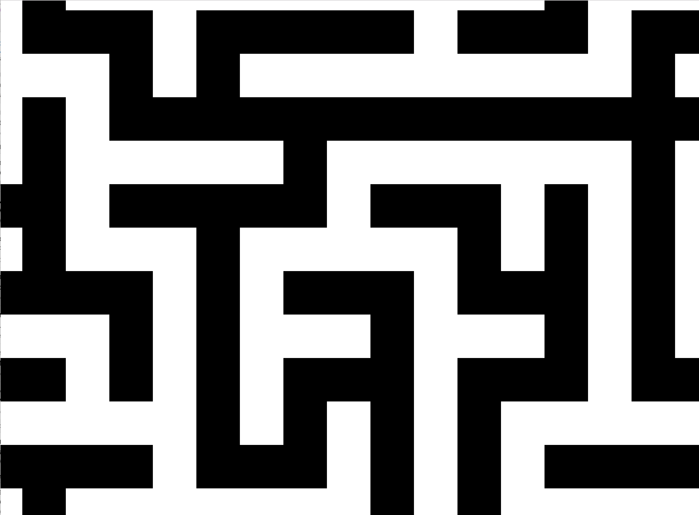
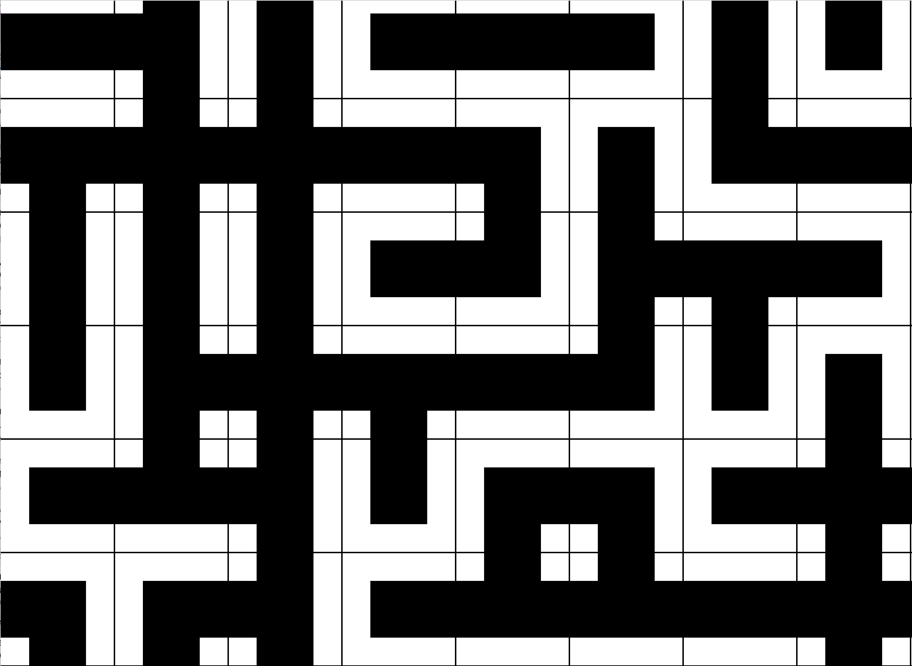

# Tiler

A simple tiling library loosely based off of https://github.com/mxgmn/WaveFunctionCollapse.

Unlike mxgmn's WaveFunctionCollapse library, this doesn't support images directly just generic "tiles". However there's nothing preventing your tiles from being images.

The below examples were created using the code in the `examples` directory.

Showing the borders of the tiles
